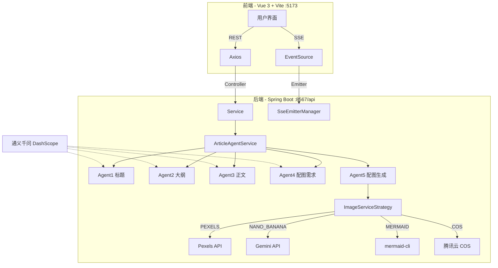
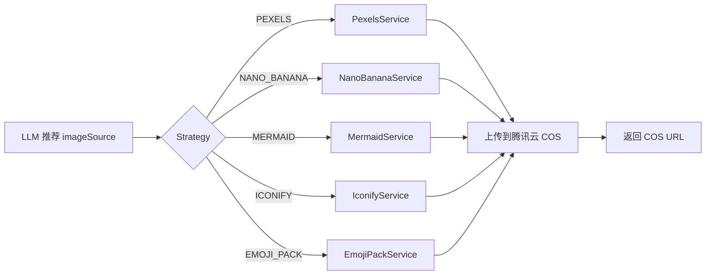

# ArticlePilot

> AI 驱动的新媒体文章一站式创作平台。基于 Vue 3 + Spring Boot 3，从一个选题到一篇带图可发布的文章，全流程自动化。

## 项目简介

ArticlePilot 是一个面向新媒体作者的内容创作工具。用户输入选题，平台调用多个 AI 智能体依次完成：

1. **生成候选标题**（LLM 给 3-5 个爆款标题方案）
2. **生成大纲**（流式输出，章节化结构）
3. **生成正文**（流式输出，按大纲逐段展开）
4. **分析配图需求**（识别需要配图的位置，生成 `{{IMAGE_PLACEHOLDER_N}}` 占位符）
5. **检索 / 生成配图**（多源策略：图库搜索、AI 生图、SVG 图表）
6. **图文合成**（把配图 URL 替换回正文占位符，导出最终 Markdown）

支持中长篇文章（2000 字左右）、SSE 实时进度推送、配图策略可配置、文章历史管理与配额控制。

## 核心特性

- **多智能体协作**：标题、大纲、正文、配图四个阶段由独立 prompt 驱动，可单独调整
- **流式输出**：大纲和正文按 token 流式推送到前端（SSE），写作过程可视化
- **配图策略模式**：抽象出 `ImageSearchService` 接口，按文章场景路由到不同数据源
  - **PEXELS**：英文图库，免费 key 即可接入
  - **NANO_BANANA**：基于 Gemini 的 AI 生图（中文 prompt 友好）
  - **MERMAID**：流程图 / 时序图 / 饼图，用 mermaid-cli 本地渲染
  - **ICONIFY**：图标库，注入式占位
  - **EMOJI_PACK**：基于 Bing 检索的 GIF / 表情包
  - **SVG_DIAGRAM**：可扩展的 SVG 图表方案
- **风格切换**：支持多套写作风格 prompt 模板（`ArticleStyleEnum`），文章自动套用
- **图文合成**：基于占位符的最终成稿，导出为 Markdown 文件
- **REST API + SSE**：所有接口风格统一在 `application.yml` 配 `context-path: /api` 下
- **自动部署**：GitHub Actions + Docker Compose + Caddy 自动 HTTPS

## 技术栈

### 后端
- Spring Boot 3.5 / Java 21
- MyBatis Flex 1.11（DAO 层）
- MySQL 9（持久化）
- Redis 7 + Spring Session（会话共享、配额计数）
- Spring AI Alibaba + DashScope（标题 / 大纲 / 正文 LLM）
- Google GenAI SDK（Gemini AI 生图）
- 腾讯云 COS（图片托管，CDN 直连）
- Knife4j / springdoc-openapi（API 文档）

### 前端
- Vue 3.5 / TypeScript 5.8
- Vite 6 / Vue Router 4 / Pinia 3
- Ant Design Vue 4
- Axios + EventSource（SSE 消费）
- ECharts 6 / Marked / SortableJS

## 架构概览



## 智能体流程

每个智能体都是独立的 prompt，定义在 [`PromptConstant.java`](src/main/java/github/comioko/articlepilot/constant/PromptConstant.java)：

| 阶段 | 智能体 | 输入 | 输出 | 模型 |
|------|--------|------|------|------|
| 1 | 标题 | 选题 | `TitleOption[]`（3-5 个候选） | DashScope |
| 2 | 大纲 | 主/副标题 | `OutlineResult`（章节列表） | DashScope（流式） |
| 3 | 正文 | 标题 + 大纲 JSON | Markdown 文本 | DashScope（流式） |
| 4 | 配图需求 | 标题 + 正文 + 可用配图方式 | `contentWithPlaceholders` + `ImageRequirement[]` | DashScope |
| 5 | 配图生成 | 配图需求 | COS URL 列表 | Pexels / Gemini / mermaid-cli |

修改 prompt 不需要改任何业务代码，编辑常量即可。

## 配图策略

`ImageServiceStrategy` 是核心策略类。所有配图实现都实现 `ImageSearchService` 接口，平台启动时自动注册到策略表，Agent4 的 LLM 根据 prompt 推荐的可用方式 + 上下文语义选择。



扩展新的配图方式：实现 `ImageSearchService`，加上 `@Service` 注解，Spring 会自动装配进 strategy map。

## 快速上手

### 环境要求

- **JDK**：21+（推荐 Zulu 21）
- **Maven**：3.9+（项目自带 `mvnw`）
- **Node.js**：22+
- **MySQL**：9.x
- **Redis**：7.x
- **mermaid-cli**（可选，仅启用 MERMAID 配图时需要）：`npm i -g @mermaid-js/mermaid-cli`

### 配置

后端默认配置在 [`application.yml`](src/main/resources/application.yml)，以下变量**必须**设置才能完整跑通：

| 变量 | 用途 | 默认值（不推荐生产用） |
|------|------|-----------------------|
| `DASHSCOPE_API_KEY` | 通义千问 LLM | 内置占位符 |
| `GEMINI_API_KEY` | Gemini AI 生图（NANO_BANANA 配图） | 占位符 |
| `PEXELS_API_KEY` | Pexels 图库 | 内置 demo key |
| `TENCENT_COS_SECRET_ID` / `TENCENT_COS_SECRET_KEY` | 腾讯云 COS 凭证 | 占位符 |
| `TENCENT_COS_REGION` | COS 地域 | `ap-guangzhou` |
| `TENCENT_COS_BUCKET` | COS 桶名 | `articlepilot-dev` |

也可以直接修改 `application.yml` 把上述默认值替换为真实值（`${ENV:default}` 语法，env 优先）。

### 数据库初始化

首次运行会自动创建表结构（MyBatis Flex 启动建表）。如需手动初始化 SQL，看 [`sql/`](sql/) 目录。

### 启动

```bash
# 后端
./mvnw spring-boot:run

# 前端
cd frontend && npm install && npm run dev
```

打开 `http://localhost:5173/` 即可访问。如果 5173 被占用，Vite 自动顺延到 5174 / 5175 等。

## 项目结构

```
ArticlePilot/
├── src/main/java/github/comioko/articlepilot/
│   ├── ArticlePilotApplication.java    # Spring Boot 启动类
│   ├── agent/                           # 智能体编排
│   ├── annotation/                      # 自定义注解（如 @AuthCheck）
│   ├── aop/                             # 拦截器
│   ├── common/                          # 通用响应（BaseResponse / ResultUtils）
│   ├── config/                          # 配置类（CORS / COS / Pexels 等）
│   ├── constant/                        # 常量与 Prompt
│   ├── controller/                      # REST 控制器
│   ├── exception/                       # 自定义异常
│   ├── manager/                         # 通用管理器（SSE Emitter 等）
│   ├── mapper/                          # MyBatis Flex Mapper
│   ├── model/                           # DTO / VO / Entity / Enum
│   ├── service/                         # 业务接口
│   └── service/impl/                    # 业务实现
├── src/main/resources/
│   └── application.yml                  # 主配置
├── frontend/                            # Vue 3 前端
├── docs/DEPLOYMENT.md                   # 部署手册
├── compose.yml                          # 生产 Compose（MySQL + Redis + Backend + Caddy）
└── deploy/                              # 部署脚本
```

## API 概览

后端统一挂载在 `/api` 下（`server.servlet.context-path`）。完整接口见 `http://localhost:8567/api/doc.html`（Knife4j）。

### 文章

| Method | Path | 说明 |
|--------|------|------|
| POST | `/article/create` | 创建任务并异步启动智能体流水线 |
| GET | `/article/progress/{taskId}` | SSE 流式订阅生成进度 |
| GET | `/article/{taskId}` | 查询最终成稿 |
| POST | `/article/list` | 分页查询历史 |
| POST | `/article/ai-modify-outline` | 基于反馈让 LLM 改大纲 |
| POST | `/article/confirm-outline` | 用户确认大纲 |
| POST | `/article/confirm-title` | 用户从候选标题中选定 |
| POST | `/article/delete` | 删除文章 |
| GET | `/article/execution-logs/{taskId}` | 查询执行统计 |

### 用户

| Method | Path | 说明 |
|--------|------|------|
| POST | `/user/register` | 注册 |
| POST | `/user/login` | 登录（Cookie 写入 SESSION） |
| GET | `/user/get/login` | 读取当前登录用户 |
| POST | `/user/logout` | 登出 |
| GET | `/user/get` / `/user/get/vo` | 查询用户信息 |

### 管理 / 其他

`/admin/userManage`、`/admin/statistics`、`/payment/*`、`/health`、`/statistics`、`/overview` 等。详见 Knife4j 文档。

## 常见问题

### mermaid-cli 不可用
```bash
npm i -g @mermaid-js/mermaid-cli
which mmdc    # 应返回路径
```
如果 npm 全局装到了非默认目录（如 `~/.hermes/node/bin`），把它软链到 `$PATH` 中的目录，例如：
```bash
ln -sf /path/to/your/global/node/bin/mmdc ~/.local/bin/mmdc
```

### 腾讯云 COS 上传失败（403 / SignatureDoesNotMatch）
- 检查 `application.yml` 里 `secret-key` 末尾**没有多余空格**（YAML 字符串会保留空格）
- 确认 bucket 名在腾讯云控制台存在，且 region 一致
- 确认 COS API 密钥对当前账号有效

### 跨域 403（前端访问后端 403）
检查 `config/CorsConfig.java` 的 `allowedOriginPatterns` 是否覆盖前端实际端口（默认是 `http://localhost:51*`，覆盖 517x 全段）。如端口不在此范围，扩展通配规则。

## 部署

完整 CI/CD、首次上线、备份与回滚步骤见 [部署手册](docs/DEPLOYMENT.md)。

本地构建验证：

```bash
./mvnw -B -ntp -DskipTests verify
cd frontend && npm ci && npm run build
```

## 许可证

仅限内部 / 学习用途，未声明开源协议。如需开源请先补充 LICENSE 文件。